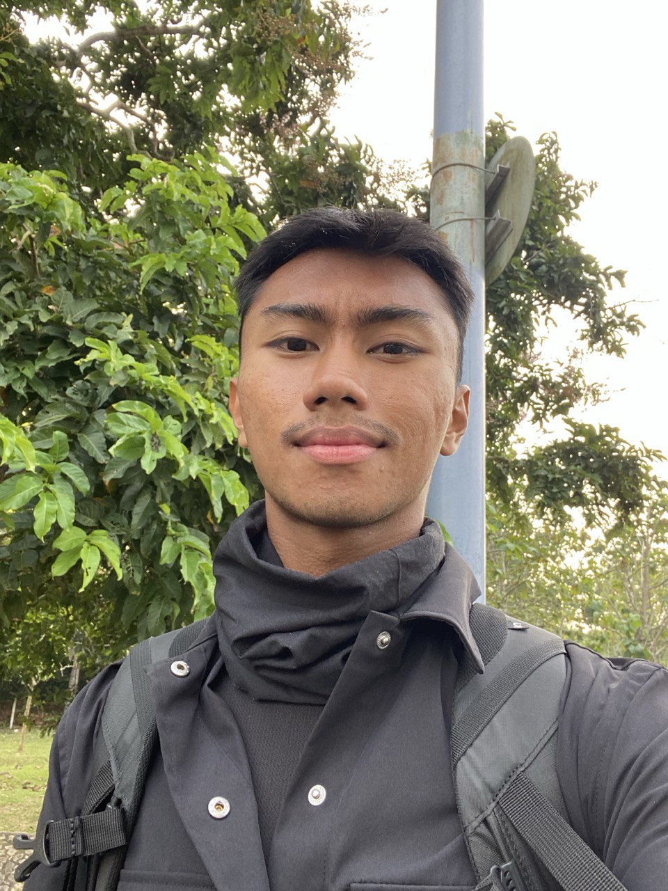

# Introduction

Hi! I'm AHMAD DANIAL ADLI BIN MOHD ZAKI, a student in the Software Maintenance and Evolution course. 

I expect to learn a lot about modern software maintenance practices and how to work with legacy systems.

- **Fun fact**: I love Wonda Kopi Tarik better than any Zus coffee choices.
- **Course Expectations**: To gain valuable experience and knowledge of maintaining and evolving softwares which I can apply in the industry later on.

  <!-- Link to the uploaded image -->

## GitHub Profile

You can view my personalized GitHub profile here (https://github.com/danialadli)

